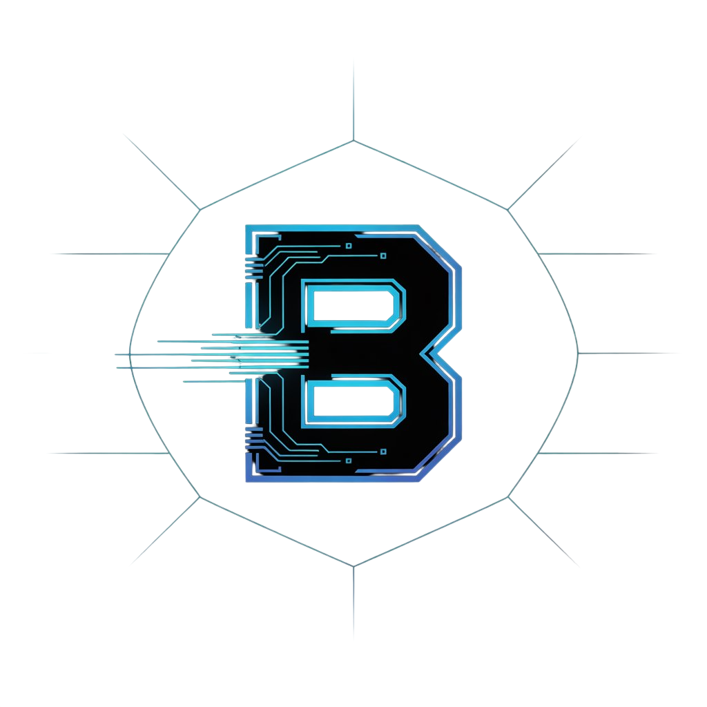

# BLACKOUT EXCHANGE

<p align="center">
  
</p>

> Leaderless Emergency Agent Economy

BLACKOUT EXCHANGE is a deterministic simulation of a degraded emergency environment where heterogeneous agents coordinate without a central orchestrator, reject malicious completion claims, and allow settlement only after verifiable coordination proof.

## 🚀 What this project proves

- Local coordination can work without a global dispatcher
- Agents can negotiate ownership using local metrics
- Failover can recover task execution after node loss
- Fake completion claims can be isolated by verifiers
- Settlement can be safely gated by proof-before-payment

## 🧱 Tech stack

- `Next.js 15` (App Router) + `TypeScript`
- `Tailwind CSS` + `Framer Motion`
- `Zustand` (simulation runtime state)
- `React Flow` (mesh topology visualization)
- `mqtt` (network transport for MQTT + FoxMQ-compatible broker)
- `@google-cloud/vertexai` (Vertex AI coordination hint generation)
- `Playwright` (end-to-end validation)

## 🗂️ Project structure (quick map)

- `src/app` → routes (`/`, `/mission-control`, `/mission-summary`)
- `src/components/dashboard` → mission control panels + Judge Demo overlay
- `src/components/network` → topology panel
- `src/lib/simulation` → engine, modules, proof/verification/settlement
- `src/store/simulation-store.ts` → runtime state + history/replay snapshots
- `e2e/judge-demo.spec.ts` → deterministic guided demo test
- `.github/workflows/ci.yml` → CI quality gates

## ⚙️ How the simulation engine works

The runtime is tick-based. At each tick, independent modules run in deterministic order:

1. `peer-discovery`
2. `negotiation`
3. `execution`
4. `failover`
5. `verification-settlement`

`chaos.ts` can inject controlled faults (`kill-agent`, `degrade-network`, `spawn-fake-completion`, `add-urgent-task`) to stress resilience and verification logic.

## 🛡️ Proof → Verification → Settlement gate

Settlement is released only when all conditions are satisfied:

1. witness quorum exists
2. proof confidence is above threshold
3. verifier quorum approves
4. no blocking rejection is present

This prevents "completed" claims from unlocking value without sufficient evidence.

## 🧪 Simulation boundary (transparency)

### Included in this repository

- In-memory peer message flow
- Witness evidence generation and pseudo hashing
- Verifier approval/rejection decisions
- Settlement receipt generation
- MQTT publish adapter (`src/lib/integrations/mqtt-transport.ts`)
- FoxMQ-compatible MQTT profile (`src/lib/integrations/swarm-sync.ts`)
- Vertex AI advisor with deterministic fallback (`src/lib/integrations/vertex-advisor.ts`)

### Not yet integrated

- Real on-chain settlement execution
- Persistent storage backend
- Production-grade cryptographic signature verification

> Summary: The demo is story-ready and technically coherent. The architecture is intentionally adapter-friendly for real protocol integration.

## 🧭 Mission Control usage

1. Open `/mission-control`
2. Click `Start Judge Demo` to run the 8-step guided flow
3. Use overlay `Prev / Next` for manual step navigation
4. Open `Mission Summary` for replay and final metrics

## 🔁 Mission Summary and replay

- Use the tick slider to inspect historical snapshots
- Use trust evolution chart to explain confidence shifts
- Show rejection decisions and settlement receipts in one flow

## 🧰 Local development

```bash
npm install
cp .env.example .env.local
npm run dev
```

Open `http://localhost:3000`.

## ✅ Quality gates

```bash
npm run lint
npm run build
npm run test:e2e
```

CI enforces the same three gates in `.github/workflows/ci.yml`.

## 🧪 Deterministic smoke run

```bash
npm run sim:smoke
```

## 🌐 Networked smoke run (MQTT + FoxMQ + Vertex AI)

```bash
npm run sim:networked
```

If `MQTT_BROKER_URL`, `FOXMQ_BROKER_URL`, or Vertex credentials are not configured, the run still succeeds with skip/fallback reporting.

## 🧠 60-second jury walkthrough

1. Show topology and highlight no central orchestrator
2. Trigger urgent task and show local negotiation
3. Force node failure and show failover event
4. Inject fake completion and show verifier rejection
5. Show settlement blocked until proof conditions are met
6. Finish with Mission Summary replay and outcome metrics

## 🧾 Submission checklist

- [ ] `lint/build/e2e` all green
- [ ] `README.md` and `ARCHITECTURE.md` aligned
- [ ] Judge Demo flow verified live
- [ ] `Swarm Integrations` panel tested with `/api/swarm/sync`
- [ ] Simulation boundary clearly stated

---

For deep technical details: [`ARCHITECTURE.md`](./ARCHITECTURE.md)
